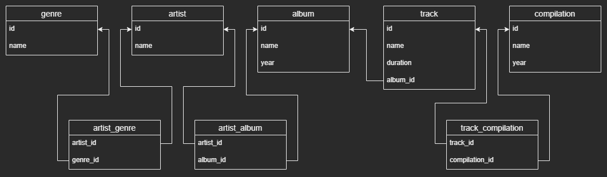

#### Схема и создание БД стримингового музыкального сервиса, тестирование запросов.

Проект схемы (таблицы и связи между ними), а также SQL-запросы, создающие спроектированную БД для стримингового музыкального сервиса.

Требования к стриминговому музыкальному сервису:
- Возможность увидеть список исполнителей.
- Для каждого исполнителя можно получить список его альбомов.
- Возможность увидеть список жанров.
- Исполнители могут петь в разных жанрах, как и к одному жанру могут принадлежать несколько исполнителей.
- Альбом могут выпустить несколько исполнителей вместе. Как и исполнитель может принимать участие во множестве альбомов.
- Для каждого альбома можно получить список треков, которые в него входят.
- У исполнителя есть имя (псевдоним).
- У жанра есть название.
- Для каждого жанра можно получить список исполнителей, которые поют в данном жанре.
- У альбома есть название и год выпуска.
- У трека есть название и длительность.
- Трек может входить в разные альбомы.
- Возможность увидеть список сборников.
- Сборник имеет название и год выпуска.
- В сборник входят различные треки из разных альбомов, один и тот же трек может присутствовать в разных сборниках.

 

Тестирование SELECT-запросов, которые выведут информацию согласно инструкциям ниже:  

1. количество исполнителей в каждом жанре;
2. количество треков, вошедших в альбомы 2019-2020 годов;
3. средняя продолжительность треков по каждому альбому;
4. все исполнители, которые не выпустили альбомы в 2020 году;
5. названия сборников, в которых присутствует конкретный исполнитель;
6. название альбомов, в которых присутствуют исполнители более 1 жанра;
7. наименование треков, которые не входят в сборники;
8. исполнителя(-ей), написавшего самый короткий по продолжительности трек (теоретически таких треков может быть несколько);
9. название альбомов, содержащих наименьшее количество треков.
    
